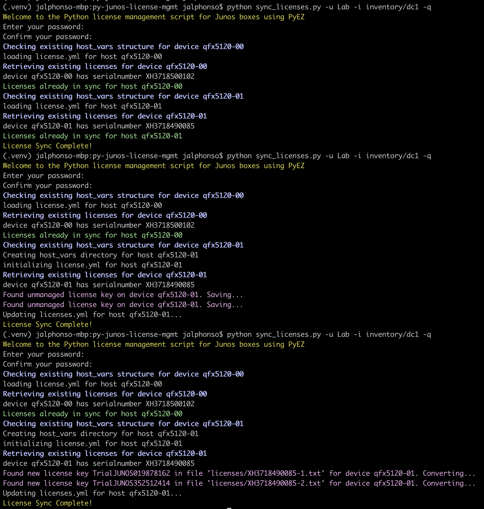
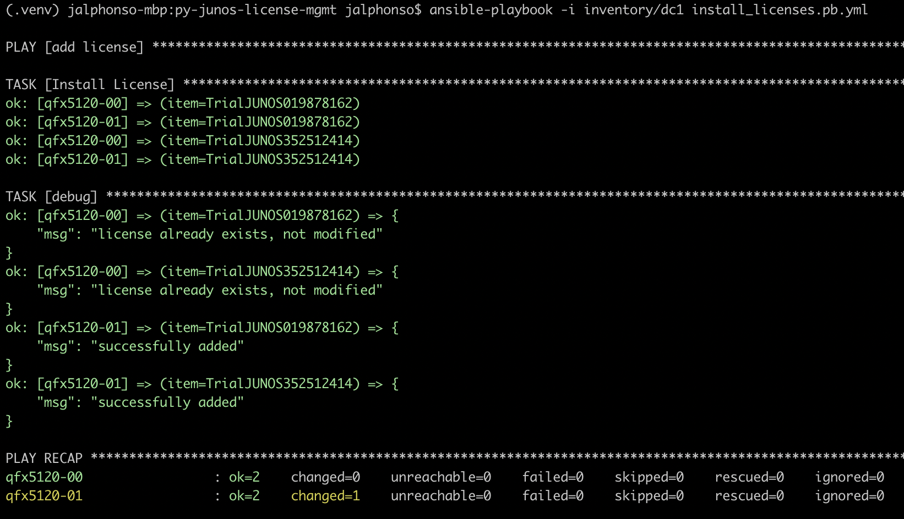

# Junos License Management
This project helps synchronize licenses. Script can be run either interactively or non-interactively. Mandatory parameters will be prompted for if not provided on the command line.

The Python portion of the project will
  1. setup the host_vars directories properly per host.
  2. retrieve currently installed licenses from device
  3. check to see if there are any new licenses in the original txt format
  4. merge the contents of 2, 3 along with any other licenses already managed via Ansible
     in the hosts respective licenses.yml file.

Concerning #3 if there is more than 1 license per device (i.e. to activate additional features),
then just name the file {serialnumber}-{anything}.txt The file globbing pattern will pick
it up and sync all licenses for a given serialnumber. i.e. For S/N:X12345 License
could be X12345-feature1.txt and X12345-feature2.txt
Otherwise just name it X12345.txt which is just the serialnumber with a .txt extension

The Ansible part of the project will install all available licenses as needed to the device.

## Example Usage and Output

